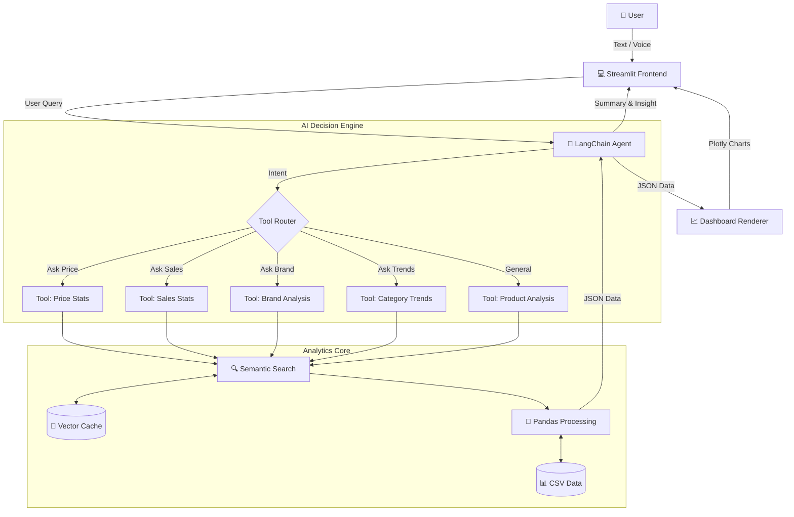

# 🛍️ E-Commerce AI Analyst  
**Trợ lý Phân tích Thương mại Điện tử bằng AI**


**E-Commerce AI Analyst** là một ứng dụng Chatbot thông minh hỗ trợ nhà bán hàng, nhà phân tích và nhà đầu tư phân tích dữ liệu thị trường từ các sàn thương mại điện tử như **Shopee, Lazada, Tiki, TikTok Shop**.

Hệ thống không chỉ trả lời bằng ngôn ngữ tự nhiên mà còn **tự động sinh Dashboard và biểu đồ trực quan** dựa trên ý định truy vấn của người dùng.

---

## 🌟 Tính Năng Chính

- **Hỏi đáp ngôn ngữ tự nhiên (NLP):**  
  Chat trực tiếp để hỏi về giá bán, doanh số, thị phần, top seller.

- **Điều khiển bằng giọng nói:**  
  Hỗ trợ nhập liệu bằng Microphone.

- **Trực quan hóa dữ liệu tự động:**  
  Hệ thống tự động sinh biểu đồ phù hợp:
  - Bar Chart
  - Pie Chart
  - Scatter Plot
  - Treemap

  Ứng dụng cho:
  - **Price Analysis:** Phân khúc giá, so sánh giá giữa các sàn
  - **Sales Analysis:** Top seller, thị phần doanh thu
  - **Review Analysis:** Phân tích đánh giá sao
  - **Category Trends:** Xu hướng ngành hàng

- **Tìm kiếm ngữ nghĩa (Semantic Search):**  
  Sử dụng `sentence-transformers` để tìm sản phẩm ngay cả khi từ khóa không khớp hoàn toàn.

---

## 🧠 Cơ Chế Hoạt Động (System Architecture)

Sơ đồ dưới đây mô tả luồng dữ liệu từ khi người dùng đặt câu hỏi đến khi hiển thị biểu đồ:


---

## 📂 Cấu Trúc Dự Án

```text
DA__CHAT/
├── app.py                          # Streamlit Frontend
├── data/
│   ├── data_fixed.csv              # Dataset đã làm sạch
│   └── product_name_embeddings.npy # Vector Embeddings (cache)
├── modules/
│   ├── agent_engine.py             # LangChain Agent & System Prompt
│   ├── analytics_core.py           # Logic phân tích (Pandas / NumPy)
│   ├── data_loader.py              # Load dữ liệu & embeddings
│   ├── tools.py                    # AI Tools cho Agent
│   ├── visualization.py            # Vẽ biểu đồ (Plotly)
│   └── database_mock.py            # Dữ liệu giả lập (testing)
└── .env                            # API Key (không commit)
````

---

## 🚀 Cài Đặt & Chạy Ứng Dụng

### 1. Clone repository
Mở cmd và chạy dòng lệnh sau:
```bash
git clone https://github.com/KhoaUs/DA__CHAT.git
cd DA__CHAT
```

---

### 2. Chuẩn bị môi trường

Yêu cầu **Python 3.10+**
Khuyến khích dùng virtual environment.

Tại thư mục DA__CHAT, mở cmd và thực hiện các dòng lệnh dưới đây để tạo môi trường ảo:

```bash
python -m venv venv

# Windows
venv\Scripts\activate

# Mac / Linux
source venv/bin/activate
```

---

### 3. Cài đặt thư viện

```bash
pip install -r requirements.txt
```

---

### 4. Cấu hình API Key

Tạo file `.env` **cùng cấp với `app.py`**:

```env
GOOGLE_API_KEY="YOUR_GEMINI_API_KEY"
```

> ⚠️ Không commit file `.env` lên GitHub

---

## 🏃‍♂️ Chạy Ứng Dụng

```bash
streamlit run app.py
```

Mở trình duyệt tại:
👉 `http://localhost:8501`

---

## 💬 Ví dụ câu hỏi mẫu

* *"Phân tích giá iPhone 15 Pro Max trên các sàn TMĐT."*
* *"Shop nào bán kem chống nắng chạy nhất trên Shopee?"*
* *"So sánh đánh giá của tai nghe Sony và JBL."*
* *"Xu hướng ngành hàng mùa hè hiện nay là gì?"*

---

## 🧠 Kiến Trúc Hệ Thống (Architecture)

1. **Input:**
   Người dùng nhập văn bản hoặc giọng nói.

2. **Agent Engine:**
   LangChain xác định ý định và lựa chọn **Tool** phù hợp.

3. **Analytics Core:**

   * Semantic Search bằng embeddings
   * Phân tích dữ liệu với Pandas / NumPy

4. **Response & Visualization:**

   * AI trả về insight dạng text
   * Dashboard & biểu đồ Plotly hiển thị trực tiếp trong chat

---

## ⚠️ Lưu Ý

* Lần chạy đầu có thể chậm do load embeddings & model NLP.
* Dataset hiện tại là **dữ liệu tĩnh phục vụ demo & nghiên cứu**.
* Không crawl dữ liệu real-time từ các sàn TMĐT.

---

## 📜 License

Dự án này được phân phối dưới giấy phép **MIT License**.

```text
MIT License

Copyright (c) 2024 DataSense

Permission is hereby granted, free of charge, to any person obtaining a copy
of this software and associated documentation files (the "Software"), to deal
in the Software without restriction, including without limitation the rights
to use, copy, modify, merge, publish, distribute, sublicense, and/or sell
copies of the Software, and to permit persons to whom the Software is
furnished to do so, subject to the following conditions:

The above copyright notice and this permission notice shall be included in all
copies or substantial portions of the Software.

THE SOFTWARE IS PROVIDED "AS IS", WITHOUT WARRANTY OF ANY KIND, EXPRESS OR
IMPLIED, INCLUDING BUT NOT LIMITED TO THE WARRANTIES OF MERCHANTABILITY,
FITNESS FOR A PARTICULAR PURPOSE AND NONINFRINGEMENT. IN NO EVENT SHALL THE
AUTHORS OR COPYRIGHT HOLDERS BE LIABLE FOR ANY CLAIM, DAMAGES OR OTHER
LIABILITY, WHETHER IN AN ACTION OF CONTRACT, TORT OR OTHERWISE, ARISING FROM,
OUT OF OR IN CONNECTION WITH THE SOFTWARE OR THE USE OR OTHER DEALINGS IN THE
SOFTWARE.

```

---

**Phát triển bởi:** [DataSense](https://www.google.com/search?q=https://github.com/KhoaUs)
